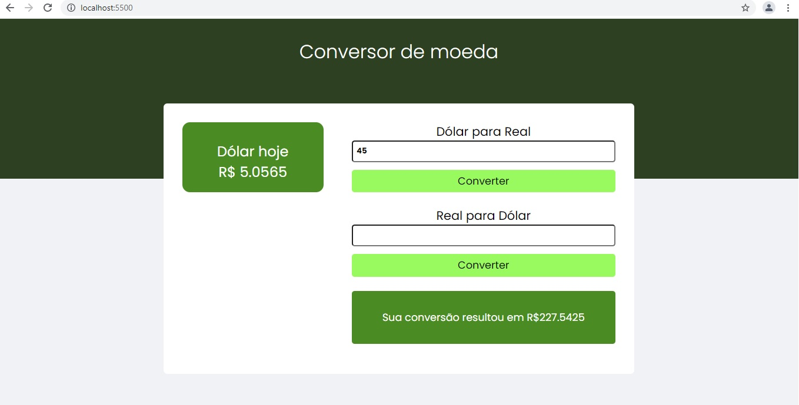

# Consumindo APIs
Pequeno programa de conversão do dolar, apenas para focar no consumo de APIs.

Consumindo API no back-end, e consumindo no front-end a API criada no back-end usando fecth api.
Habilitando e usando o cors no navegador.

API que fornece o Valor do Dolar em tempo real extraida da [AwesomeApi](https://docs.awesomeapi.com.br/api-de-moedas)

## Iniciando o projeto
Para visualizar o projeto:
- Clone o projeto
- `npm install`, para instalar as dependências
- `npm start`, acessar localhost:5500

### Tecnologias
- Axios
- Express
- Node
- Html, Css e JavaScript
